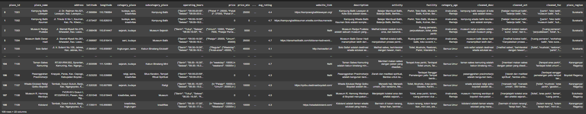
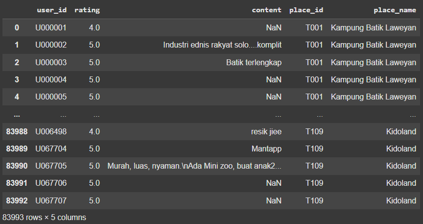

# 👨‍👩‍👧‍👦 Web-Based Family-Friendly Recommendation System

> 🚧 Status: Ongoing – last updated June 2025

---

## 🧠 Overview

The goal of this project is to build a web-based recommendation system that suggests suitable tourist spots for families by analyzing destination metadata and user behavior.  The system gathers data from various sources, including websites, social media, and Google Maps, and uses that data to feed machine learning models for destination matching.

---

## 👩‍💻 My Role

**Position:** Data Engineer & Machine Learning Engineer  
I was responsible for:
- Collecting 109 tourist destination data from multiple sources (websites, social media, Google Maps)
- Scraping and preprocessing Google Maps review for 109 tourist destination data using Python
- Preparing the dataset pipeline for model training and evaluation
- Building machine learning model (in progress)

---

## 👩‍💻 File Description

- **tourist_spots.xlsx**  
  Original EduTourism destination data in Excel format, scraped from multiple sources.

- **wisata(fix).csv**  
  Cleaned version of `tourist_spots.xlsx`, saved in CSV format for easier use in Python.

- **scrape_reviews.py**  
  Python script using `Selenium` to automate scraping of Google Maps reviews for each tourist spot.

- **google_reviews/**  
  Folder containing 109 Excel files, each representing raw review data from a destination.

- **preprocess_reviews.ipynb**  
  Jupyter notebook to process and merge all 109 raw review files into one clean dataset.

- **user(fix).csv**  
  Final dataset: cleaned, merged, and structured review data from Google Maps, ready for analysis and modeling.

-- 

## 📷 Documentation

- Cleaned User Data (from user(fix).csv)
 

- Cleaned Item Data (from wisata(fix).csv)

## Tools
Python ▪️ Excel ▪️ ImportFromWeb (Web Scraping using Google Sheets)

